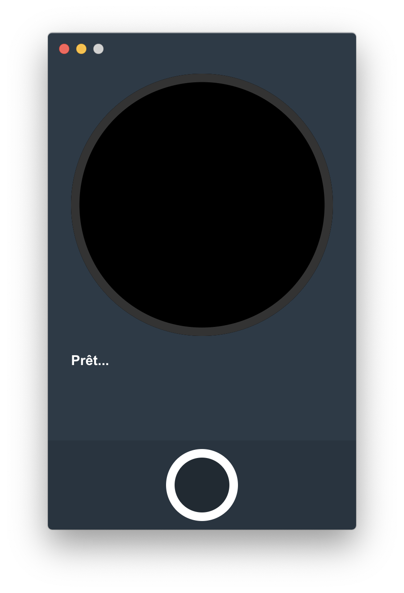
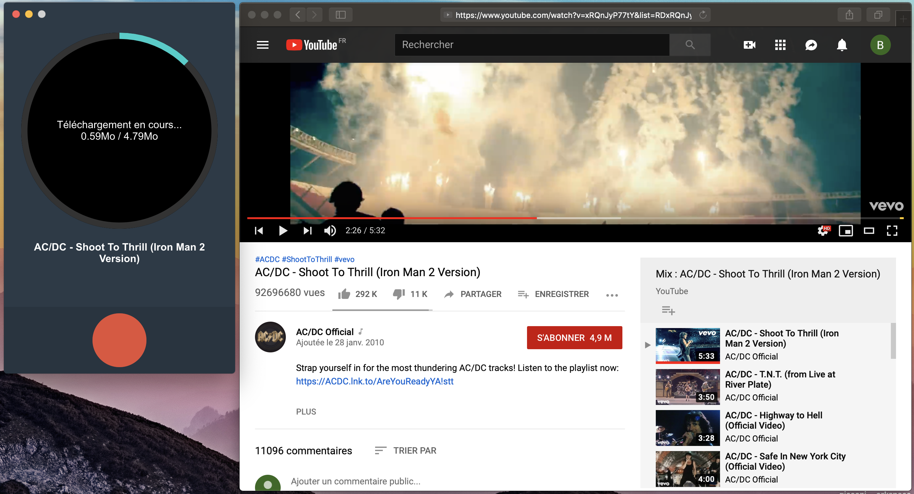
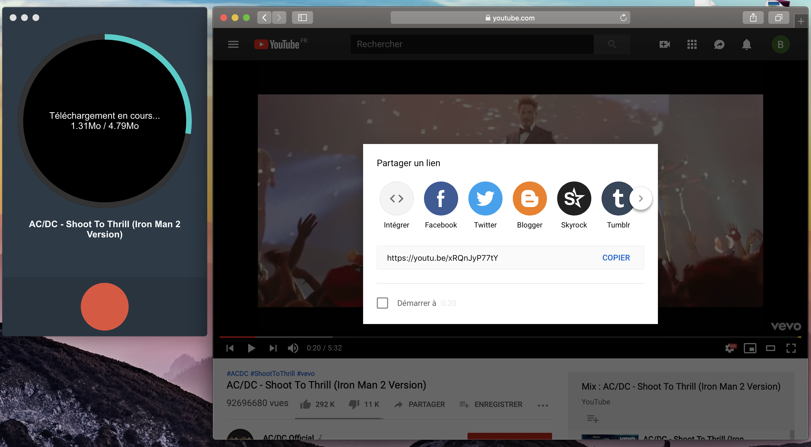

<p align="center">
  
</p>

<div align="center">
  
</div>

<p align="center">Simple and user-friendly application for download YouTube videos.</p>

---

## About
Rekord is an application for download YouTube videos and convert them to MP3.
The latter is running on electron and Angular

## Features

- Detect a YouTube link automatically in the clipboard
- Convert video to MP3

## Roadmap

:memo: Future plans for enhancements and development:

- Possibility to choose between  download video or audio only
- Make the app even more fun

## Download

Rekord is available for Windows 32/64, Mac OSX and Debian/Ubuntu flavored Linux.

Download the latest version from the [releases](https://github.com/barbhackk/rekord/releases) page.

## Use

Launch the app and copy any Youtube link with the right mouse button or with the combination [Ctrl] + c on Windows and Linux, [cmd] + c on Mac.

<p align="center">
  
</p>

<p align="center">
  
</p>

No need to past Youtube link into the application. This automatically captures all youtube links validating copy in the clipboard. When this is the case, it displays the video information. Just click on the red 'save' button.

<div align="center">
  
</div>

<p align="center">A 'Rekord Download' folder is created at yout Document root.</p>

## Technical

Rekord is built with Electron and Angular

### Install
To clone and run this repository, you'll need Git and Node.js (which comes with npm) installed on your computer. From your command line:

```bash
# Clone this repository
git clone https://github.com/barbhackk/rekord.git
# Go into the repository
cd rekord
# install dependencies
npm i
```

### Development mode
This app works with a local environment variable system. This config is in .env file.
For development, set variables like this:

```
PACKAGE=false
HOST=http://localhost:4200/
```

Run in first terminal `npm run start` for a dev server. In second terminal run `npm run electron`.

The app will automatically reload if you change any of the source files.

### Production mode

Set variables like this:

```
PACKAGE=true
HOST=http://localhost:4200/
```

Run `npm run electron-build`.
The build artifacts will be stored in the `dist/` directory with a production build.

### Build

For MacOS
Run `npm run package-mac`.

For Windows 32/64
Run `npm run package-win`.

For Linux
Run `npm run package-linux`.


# Warning : 
  > This app is not a hacking tool. In case you are tempted to use Rekord to download nonfree music, you have an original copy at home. In addition, I created this application to show what I can do in application development using Angular. I therefore release myself from all responsabilities in case of improper use of this application :+1:

### Licence

MIT :copyright: [Barbhackk](https://github.com/barbhackk)